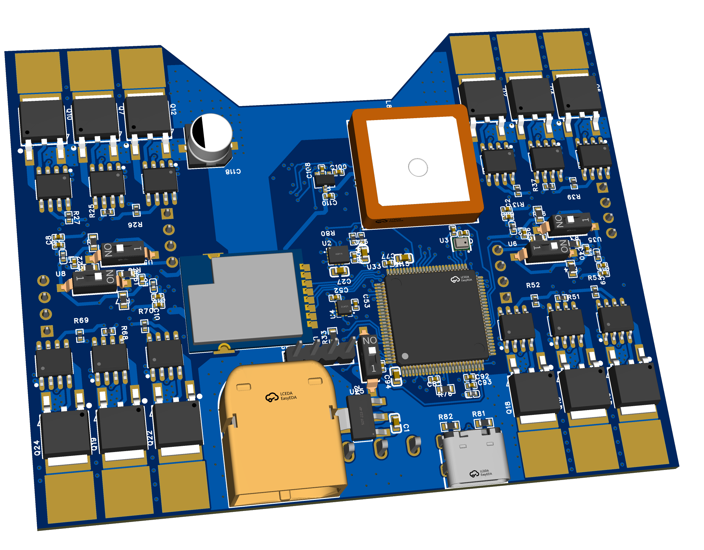
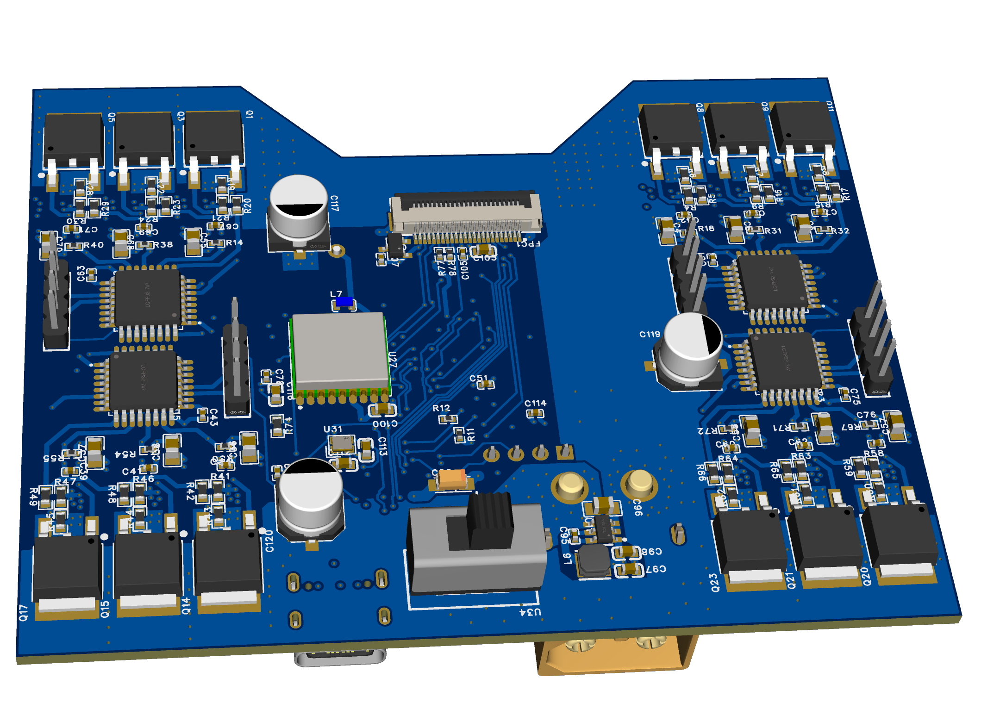

# IRIS
Independent Robotic Import System

IRIS is centered around a mass-manufacturable low-cost PCB, containing a flight controller and 4 ESCs. Designed with the idea of delivering Skittles autonomously, IRIS is built from the ground-up for autonomous operation in swarms. With a rich sensor set and high degree of customizability, IRIS represents an accessible, low-cost entry into the world of autonomous and swarm drone design.

## Highlights
 - STM32H743 MCU clocked at 480 MHz (ARM Cortex M7)
 - 2MB Flash + 1MB RAM
 - IMU, Barometer, Magnetometer, GPS
 - OV2640 Camera connector
 - 2.4GHz Radio Transciever
 - nanoELRS header
 - 4 ESCs capable of sensorless drive
 - XT60 battery connector
 - 2S to 3S battery voltages
 - USB-C connector for programming
 - 4-layer PCB design

## Table of Contents

## Design Features
### PCB Design
The PCB design features a 4-layer PCB stackup for lowered manufacturing costs, with a (nearly) continuous ground plane for reduced RF interference. The area under the MCU and core sensors also feature a continuous 3.3V power plane. The high voltage and current for the ESCs are routed on large copper pours on the bottom layer, with cross-layer connections connected by suture vias.

The total board dimensions are 3.650" by 2.856", a little larger than a credit card.

Power is routed on 3 different voltages: unregulated 7.4V nominal from the battery to the ESCs, regulated 5V for the radio and camera, and 3.3V stepped down from the 5V for IC logic. 5V power can be switched from the battery to USB to turn off the board or to enable flashing.

The main flight controller MCU is programmable over USB. The 4 ESC MCUs require a serial programmer, with ground, rx and tx exposed on header pins. All MCUs have a dedicated switch for a physical boot selector.

### 3D Printed Frame
The IRIS board is highly versatile, compatible with many motor and propeller types, and users are encouraged to design custom housings and experiment with varying batteries and motors. For new drone enthusiasts, IRIS recommends a 2S setup with 1103 motors.
This beginner setup pairs nicely with the minimalist frame to provide a simple low-cost entry into autonomous drones.

## Bill of Materials

| No. | Description | Manufacturer | Price |
| --- | ----------- | ------------ | ----- |
| 1 | IRIS PCB Order + Stencil | JLCPCB | 27.00
| 2 | PCB Components | LCSC | 79.91 |
| 3 | 1000 mAh 2S LiPo Battery | Admiral | 9.99 |
| 4 | 4x 8000 kV 1103 Brushless Motor | HappyModel | 23.99 |

### PCB Component Bill of Materials 
Total cost from LCSC: **$79.91** (including minimum order quantity requirements for 1 PCB)

| No. | Quantity | Comment                                    | Designator                                                                                                                                               | Footprint                            | Value | Manufacturer Part                          | Manufacturer           | Supplier Part | Supplier | LCSC Price | LCSC Stock | JLCPCB Price |
| --- | -------- | ------------------------------------------ | -------------------------------------------------------------------------------------------------------------------------------------------------------- | ------------------------------------ | ----- | ------------------------------------------ | ---------------------- | ------------- | -------- | ---------- | ---------- | ------------ |
| 1   | 2        | 10uF                                       | C1,C100                                                                                                                                                  | C0603                                | 10uF  | CL10A106KP8NNNC                            | SAMSUNG(三星)          | C19702        | LCSC     |            |            | 0.0012       |
| 2   | 10       | 1uF                                        | C2,C8,C9,C10,C51,C93,C107,C108,C109,C110                                                                                                                 | C0402                                | 1uF   | CL05A105KO5NNNC                            | SAMSUNG(三星)          | C29266        | LCSC     |            |            | 0.0005       |
| 3   | 38       | 100nF                                      | C3,C7,C11,C12,C22,C24,C28,C29,C31,C32,C39,C40,C41,C43,C52,C53,C54,C60,C61,C62,C63,C66,C67,C69,C71,C75,C76,C77,C78,C79,C80,C81,C89,C92,C95,C105,C106,C114 | C0402                                | 100nF | CC0402X7R25V104KN                          | TORCH(火炬)            | C53084459     | LCSC     |            |            | 0.0004       |
| 4   | 12       | 22uF                                       | C4,C5,C6,C36,C37,C38,C55,C57,C58,C59,C68,C70                                                                                                             | C0805                                | 22uF  | CL21A226MAYNNNE                            | SAMSUNG(三星)          | C602037       | LCSC     |            |            | 0.005        |
| 5   | 3        | 2.2uF                                      | C25,C115,C116                                                                                                                                            | C0603                                | 2.2uF | CL10A225KO8NNNC                            | SAMSUNG(三星)          | C23630        | LCSC     |            |            | 0.001        |
| 6   | 1        | 10nF                                       | C27                                                                                                                                                      | C0603                                | 10nF  | CC0603KRX7R9BB103                          | YAGEO(国巨)            | C100042       | LCSC     |            |            | 0.0004       |
| 7   | 1        | 4.7uF                                      | C94                                                                                                                                                      | C0603                                | 4.7uF | CL10A475KO8NNNC                            | SAMSUNG(三星)          | C19666        | LCSC     |            |            | 0.0015       |
| 8   | 1        | 10uF                                       | C96                                                                                                                                                      | C0805                                | 10uF  | CL21B106KOQNNNE                            | SAMSUNG(三星)          | C95841        | LCSC     |            |            | 0.0041       |
| 9   | 2        | 22uF                                       | C97,C98                                                                                                                                                  | C0603                                | 22uF  | CL10A226MP8NUNE                            | SAMSUNG(三星)          | C86295        | LCSC     |            |            | 0.0022       |
| 10  | 1        | 10uF                                       | C99                                                                                                                                                      | CAP-SMD_L3.2-W1.6-RD-C7171           | 10uF  | TAJA106K016RNJ                             | Kyocera AVX            | C7171         | LCSC     |            |            | 0.0211       |
| 11  | 1        | 15pF                                       | C103                                                                                                                                                     | C0603                                | 15pF  | CL10C150JB8NNNC                            | SAMSUNG(三星)          | C1644         | LCSC     |            |            | 0.0008       |
| 12  | 2        | 10pF                                       | C112,C113                                                                                                                                                | C0603                                | 10pF  | CC0603JRNPO9BN100                          | YAGEO(国巨)            | C106245       | LCSC     |            |            | 0.0005       |
| 13  | 4        | 330uF                                      | C117,C118,C119,C120                                                                                                                                      | CAP-SMD_BD6.3-L6.6-W6.6-LS7.2-FD_3   | 330uF | RVT16V330M6X8                              | JIERR(捷而瑞)          | C47023104     | LCSC     |            |            | 0.0079       |
| 14  | 1        | XT60PW-M                                   | CN1                                                                                                                                                      | CONN-TH_XT60PW-M                     |       | XT60PW-M                                   | AMASS(艾迈斯)          | C98732        | LCSC     |            |            | 0.0763       |
| 15  | 1        | FPC-05F-24PH20                             | FPC1                                                                                                                                                     | FPC-SMD_24P-P0.50_FPC-05F-24PH20     |       | FPC-05F-24PH20                             | XUNPU(讯普)            | C2856805      | LCSC     |            |            | 0.0148       |
| 16  | 5        | HX PH254-01-04-Z-L11.5 straight pin header | H1,H2,H3,H4,H5                                                                                                                                           | HDR-TH_4P-HX-PH254-01-04-Z-L11.5     |       | HX PH254-01-04-Z-L11.5 straight pin header | hanxia(韩下)           | C52016392     | LCSC     |            |            | 0.0045       |
| 17  | 5        | BLM15PD121SN1D                             | L1,L2,L3,L4,L5                                                                                                                                           | L0402                                |       | BLM15PD121SN1D                             | muRata(村田)           | C76891        | LCSC     |            |            | 0.0017       |
| 18  | 1        | 4.7uH                                      | L6                                                                                                                                                       | IND-SMD_L3.0-W3.0-1                  | 4.7uH | ANR3015T4R7M                               | APV(爱普微)            | C7427089      | LCSC     |            |            | 0.0055       |
| 19  | 1        | 47nH                                       | L7                                                                                                                                                       | IND-SMD_L1.8-W1.0                    | 47nH  | AHW1608C-47NJTF                            | APV(爱普微)            | C6807998      | LCSC     |            |            | 0.0059       |
| 20  | 1        | BWGNSCNX18-18W4                            | L8                                                                                                                                                       | ANT-TH_L18.0-W18.0_C9900026472       |       | BWGNSCNX18-18W4                            | BAT WIRELESS(蝙蝠无线) | C784395       | LCSC     |            |            | 0.1032       |
| 21  | 24       | IRLR7843TRPBF                              | Q1,Q2,Q3,Q4,Q5,Q6,Q7,Q8,Q9,Q10,Q11,Q12,Q13,Q14,Q15,Q16,Q17,Q18,Q19,Q20,Q21,Q22,Q23,Q24                                                                   | TO-252-3_L6.6-W6.1-P4.57-LS9.9-BR-CW |       | IRLR7843TRPBF                              | TECH PUBLIC(台舟)      | C19268133     | LCSC     |            |            |              |
| 22  | 23       | 10kΩ                                       | R1,R2,R3,R4,R9,R10,R15,R21,R24,R30,R33,R34,R36,R41,R46,R47,R57,R58,R63,R64,R74,R75,R76                                                                   | R0603                                | 10kΩ  | RC0603FR-0710KL                            | YAGEO(国巨)            | C98220        | LCSC     |            |            | 0.0003       |
| 23  | 24       | 33kΩ                                       | R5,R6,R7,R8,R16,R17,R19,R20,R22,R23,R28,R29,R42,R43,R44,R45,R48,R49,R59,R60,R61,R62,R65,R66                                                              | R0603                                | 33kΩ  | FRC0603F3302TS                             | FOJAN(富捷)            | C2907028      | LCSC     |            |            | 0.0002       |
| 24  | 4        | 2.2kΩ                                      | R11,R12,R79,R80                                                                                                                                          | R0402                                | 2.2kΩ | FRC0402J222 TS                             | FOJAN(富捷)            | C2906920      | LCSC     |            |            | 0.0001       |
| 25  | 18       | 270kΩ                                      | R13,R14,R37,R38,R39,R40,R50,R51,R52,R53,R54,R55,R67,R68,R69,R70,R71,R72                                                                                  | R0402                                | 270kΩ | RC0402FR-07270KL                           | YAGEO(国巨)            | C163475       | LCSC     |            |            | 0.0002       |
| 26  | 6        | 100kΩ                                      | R18,R25,R26,R27,R31,R32                                                                                                                                  | R0402                                | 100kΩ | RC0402FR-07100KL                           | YAGEO(国巨)            | C60491        | LCSC     |            |            | 0.0002       |
| 27  | 1        | 1kΩ                                        | R77                                                                                                                                                      | R0402                                | 1kΩ   | RC0402FR-071KL                             | YAGEO(国巨)            | C106235       | LCSC     |            |            | 0.0002       |
| 28  | 1        | 4.7kΩ                                      | R78                                                                                                                                                      | R0402                                | 4.7kΩ | RC0402FR-074K7L                            | YAGEO(国巨)            | C105871       | LCSC     |            |            | 0.0002       |
| 29  | 2        | 5.1kΩ                                      | R81,R82                                                                                                                                                  | R0603                                | 5.1kΩ | FRC0603F5101TS                             | FOJAN(富捷)            | C2907044      | LCSC     |            |            | 0.0002       |
| 30  | 12       | MIC4604YM-TR                               | U1,U7,U10,U13,U14,U16,U17,U19,U20,U21,U22,U24                                                                                                            | SOIC-8_L4.9-W3.9-P1.27-LS6.0-BL      |       | MIC4604YM-TR                               | MICROCHIP(美国微芯)    | C628050       | LCSC     |            |            | 0.2507       |
| 31  | 1        | ICM-42688-P                                | U2                                                                                                                                                       | LGA-14_L3.0-W2.5-P0.50-TL            |       | ICM-42688-P                                | TDK InvenSense(应美盛) | C1850418      | LCSC     |            |            | 1.7154       |
| 32  | 1        | BMP280                                     | U3                                                                                                                                                       | LGA-8_L2.5-W2.0-P0.65_AMP6127        |       | BMP280                                     | Bosch(博世)            | C83291        | LCSC     |            |            | 0.9236       |
| 33  | 1        | LIS3MDLTR                                  | U4                                                                                                                                                       | LGA-12_L2.0-W2.0-P0.50-BL            |       | LIS3MDLTR                                  | ST(意法半导体)         | C478483       | LCSC     |            |            | 0.7584       |
| 34  | 5        | 2.54-1P TPGT                               | U5,U6,U8,U12,U35                                                                                                                                         | SW-SMD_2P-L6.2-W2.5-LS9.4            |       | 2.54-1P TPGT                               | SHOU HAN(首韩)         | C7421519      | LCSC     |            |            | 0.0678       |
| 35  | 4        | AT32F421K8T7                               | U9,U15,U18,U23                                                                                                                                           | LQFP-32_L7.0-W7.0-P0.80-LS9.0-BL     |       | AT32F421K8T7                               | ARTERY(雅特力)         | C3029575      | LCSC     |            |            | 0.1338       |
| 36  | 1        | AP63205WU-7                                | U11                                                                                                                                                      | TSOT-23-6_L2.9-W1.6-P0.95-LS2.8-BL   |       | AP63205WU-7                                | DIODES(美台)           | C2071056      | LCSC     |            |            | 0.0699       |
| 37  | 1        | MIC39100-3.3WS-TR                          | U25                                                                                                                                                      | SOT-223-4_L6.5-W3.5-P2.30-LS7.0-BR   |       | MIC39100-3.3WS-TR                          | MICROCHIP(美国微芯)    | C481371       | LCSC     |            |            | 0.1444       |
| 38  | 1        | ATGM336H-5N31                              | U27                                                                                                                                                      | GPSM-SMD_ATGM336H-TR                 |       | ATGM336H-5N31                              | 杭州中科微             | C90770        | LCSC     |            |            | 0.4618       |
| 39  | 1        | XC6206-1.2V                                | U29                                                                                                                                                      | SOT-23-3_L3.0-W1.6-P1.90-LS2.8-BR    |       | XC6206-1.2V                                | YONGYUTAI(永裕泰)      | C49446790     | LCSC     |            |            | 0.0072       |
| 40  | 1        | XC6206-2.8V                                | U30                                                                                                                                                      | SOT-23-3_L2.9-W1.6-P1.90-LS2.8-BR    |       | XC6206-2.8V                                | YONGYUTAI(永裕泰)      | C2892669      | LCSC     |            |            | 0.0063       |
| 41  | 1        | 48MHz                                      | U31                                                                                                                                                      | CRYSTAL-SMD_4P-L2.0-W1.6-BL          | 48MHz | ABM11W-48.0000MHZ-7-B1U-T3                 | ABRACON                | C1985532      | LCSC     |            |            | 0.0751       |
| 42  | 1        | E01C-ML01SP4                               | U32                                                                                                                                                      | COMM-SMD_E01C-ML01SP4                |       | E01C-ML01SP4                               | EBYTE(亿佰特)          | C2965508      | LCSC     |            |            | 0.4266       |
| 43  | 1        | STM32H743VIT6                              | U33                                                                                                                                                      | LQFP-100_L14.0-W14.0-P0.50-LS16.0-BL |       | STM32H743VIT6                              | ST(意法半导体)         | C114409       | LCSC     |            |            | 1.3165       |
| 44  | 1        | SS12D10G5                                  | U34                                                                                                                                                      | SW-TH_SHOU-HAN_SS12D10G4             |       | SS12D10G5                                  | SHOU HAN(首韩)         | C7431054      | LCSC     |            |            | 0.0257       |
| 45  | 1        | KH-TYPE-C-16P                              | USB3                                                                                                                                                     | USB-C-SMD_KH-TYPE-C-16P              |       | KH-TYPE-C-16P                              | kinghelm(金航标)       | C709357       | LCSC     |            |            | 0.0113       |
|     |          |                                            |                                                                                                                                                          |                                      |       |                                            |                        |               |          |            |            |              |