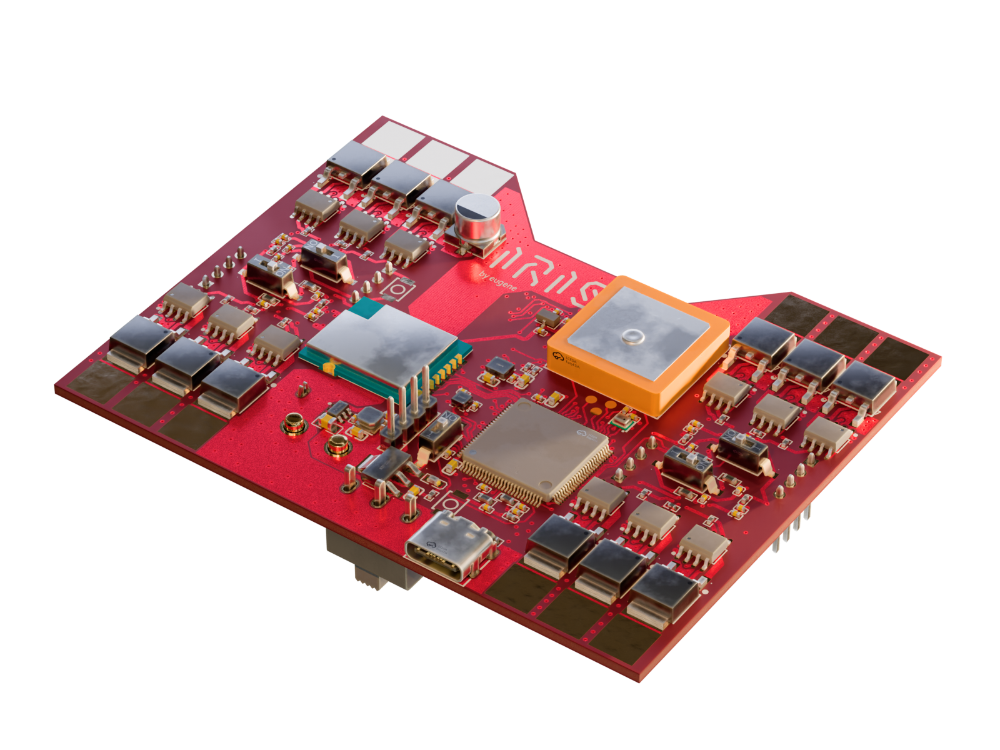
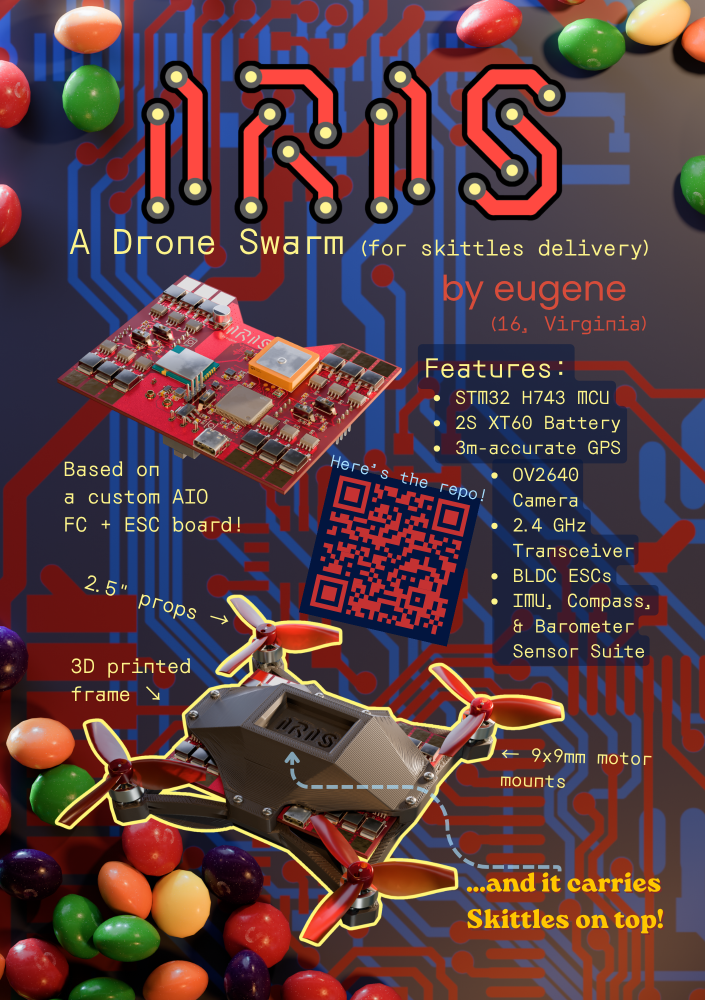
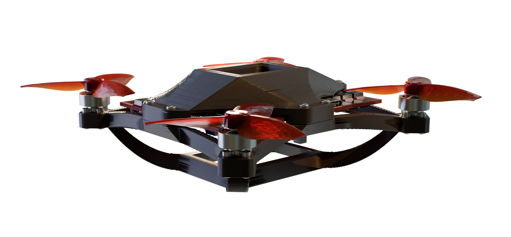
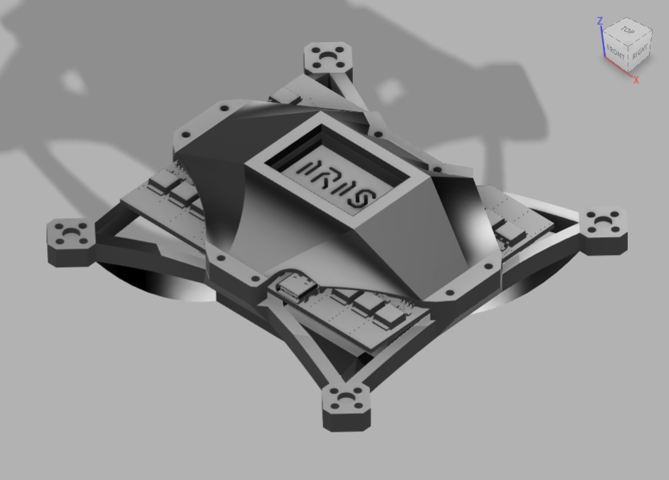

> A low-cost quadcopter platform designed for autonomous swarm operations.

## Overview
IRIS is centered around a mass-manufacturable low-cost PCB, containing a flight controller and 4 ESCs. Designed with the idea of delivering Skittles autonomously, IRIS is built from the ground-up for autonomous operation in swarms. With a rich sensor set and high degree of customizability, IRIS represents an accessible, low-cost entry into the world of autonomous and swarm drone operations. I began this project because I found a lack of accessible drone designs that are for more than just 'fun FPV flying', and I wanted to be able to program a drone to do cool things. IRIS represents a rethinking of small drone design, believing that small drones can and should be autonomous and that everyone should be able to program a drone.

## Features
 - STM32H743 MCU
 - IMU, Barometer, Magnetometer, GPS
 - Integrated 4-in-1 ESC with sensorless drive
 - OV2640 camera for computer vision
 - 2.4GHz Radio Transciever + nanoELRS header
 - 2S LiPo input, XT60 connector
 - 3D-printed frame

## Table of Contents
- [Design Features](#design-features)
  - [Flight Controller Design](#flight-controller-design)
  - [ESC Design](#esc-design)
  - [Frame Design](#frame-design)
- [Getting Started](#getting-started)
- [PCB Assembly](#pcb-assembly)
- [Bill of Materials](#bill-of-materials)
- [Drone Assembly](#drone-assembly)
- [Firmware](#firmware)
- [Roadmap](#roadmap)

## Hack Club Magazine Page

## Design Features

### Flight Controller Design

  
&nbsp; &nbsp; &nbsp; &nbsp;
  

[Schematic](./pcb/schematics/Flight_Controller_Schematic.svg)

The PCB design features a 4-layer PCB stackup for lowered manufacturing costs, with a (nearly) continuous ground plane for reduced RF interference. The area under the MCU and core sensors also feature a continuous 3.3V power plane. The high voltage and current for the ESCs are routed on large copper pours on the bottom layer, with cross-layer connections connected by suture vias.

The total board dimensions are 3.650" by 2.856", a little larger than a credit card.

The main flight controller MCU is programmable over USB. The 4 ESC MCUs require a serial programmer, with ground, rx and tx exposed on header pins. All MCUs have a dedicated switch for a physical boot selector.

### ESC Design

[Schematic](./pcb/schematics/ESC_Schematics/Motor1_ESC_Schematic.svg)

The ESC design features an STM32F303K8T6 microcontroller, a very powerful MCU that enables accurate back-emf drive even for high kV motors. 

Loosely based off of this open-source design I found,
https://electronoobs.com/eng_arduino_tut91.php, the wiring diagram was very helpful to guide the general layout of my ESC. The control logic is loosely based off of the arduino code, though it had to be completely rewritten to interface with STM32 hardware (really all BLDC motor control logic is the same, but nice understandable code was helpful).

### Frame Design
The frame design merges swooping curves and sharp geometric angles in a retrofuturistic visual style. Inspired by the Theme Building at LAX, the frame arms are each constructed with 3 catenary curves, with the bottom arches merging together to form the cradle for the battery.

The bottom also features a -30º camera mount, which facilitates autonomous navigation, and turns into the perfect FPV mount when flown inverted.

At the top of the frame, a little cradle with a minimalist IRIS logo debossed reserves space for a small collection of Skittles, easily dumped out by flipping the drone.

The drone frame is constructed in two pieces and held together by 8 M2 screws. The bottom half contains a battery mount and 4 9x9mm motor mounts, while the top half clamps the PCB down. The top cover shields the bulk of the PCB while leaving the high-current ESC MOSFET sections exposed for cooling, and is bolted down using 8 10mm long M2 screws and heat set inserts on the bottom half.

## Getting Started

### Prerequisites

- EasyEDA Pro (recommended)
- KiCAD 10.0 (broken DRC rules)
- Fusion 360
- Blender 5.0+ ([pcb2blender](https://github.com/30350n/pcb2blender) extension required for textures)

### For KiCAD Users:
This project was made in the free software EasyEDA Pro, and the design is native to that software. The PCB design has been converted to a KiCAD project for easier access to the design, but there may be some errors that have occurred during the import process, in particular trace clearances and zone fill rules.

> NOTE: The KiCAD imported project relies on 3D models and footprints from LCSC, which were imported using [easyeda2kicad.py](https://github.com/uPesy/easyeda2kicad.py).

### Repository Structure
All of the files for the flight controller + ESC board are contained in `pcb/`, with fabrication files in `pcb/fabrication/`. All fabrication files are to [JLCPCB](https://jlcpcb.com/) specifications. All part numbers are from [LCSC](https://www.lcsc.com/).

The frame CAD files can be found in the `frame/` directory, with (metric) STL and 3MF exports ready for 3D printing. The cover and bottom were designed in the same Fusion360 Part, and the IRIS_Assembly.f3z is the total assembly including parts I did not design.

All of the renders on the documentation were created using Blender 5.1, and render files can be found in `docs/render/`.

## PCB Assembly

### PCB Component Bill of Materials
[PCB Component BOM](./pcb/fabrication/BOM.md)

Total cost from LCSC: **$103.21**
[LCSC Quote](./pcb/fabrication/LCSC_BOM_export.xls)

### Assembly

The [PCB gerbers](./pcb/fabrication/gerbers.zip) can be manufactured by JLCPCB with the simple 4-layer PCBA economical service. Two-sided automated assembly is quite expensive however, so first prototypes will be assembled manually using solder stencils. PCB components can be ordered from LCSC using the [LCSC BOM](./pcb/fabrication/BOM_Board1_PCB1.xlsx).
> NOTE: The large copper pours are connected directly to a lot of the pads, manual soldering will require the use of a hot air rework station and powerful soldering iron

## Bill of Materials
> Note: the full list of components for the PCB was not included in this BOM to save space, the component BOM can be found [here](./pcb/fabrication/BOM.md)

| Part | Description | Link | Price |
| --- | ----------- | ------------ | ----- |
| FC+ESC | 4-layer PCB A Economic, HASL(leaded) finish, 2 stencils w/ framework | [JLCPCB](https://cart.jlcpcb.com/quote) (Please upload ./pcb/fabrication/gerbers.zip to order the PCB) | 29.23 |
| FC+ESC | IRIS PCB Components | [LCSC](https://www.lcsc.com/) (Please upload ./pcb/fabrication/BOM_Board1_PCB1.xlsx to order the components) | 103.21 |
| Battery | 1000 mAh 2S LiPo with XT60 connector| [Admiral](https://motionrc.com/products/admiral-1000mah-2s-7-4v-30c-lipo-battery-with-xt60-connector-epr10002x6) | 9.99 |
| Motors | 4x 8000 kV 1103 Brushless DC | [AliExpress](https://www.aliexpress.us/item/3256808118156099.html) | 23.99 |
| Propellers | Gemfan 2512 2.5Inch 3-Blade 1.5mm Hole Propeller - 4CW+4CCW | [Pyrodrone](https://pyrodrone.com/products/gemfan-2512-2-5inch-3-blade-1-5mm-2mm-hole-propeller-4cw-4ccw) | 4.99 |
| Camera | OV2640 with SCCB cable | [AliExpress](https://www.aliexpress.us/item/3256805331385102.html) | 4.20 |
| Heat-set inserts | M2x2.5mm, 3.5mm OD Knurled Brass Threaded Heat Set Inserts | [Rusty Bolt Shop](https://ebay.us/m/7A3cL3) | 1.70 |
| Frame screws | M2x10mm screws | [The Rusty Bolt Shop](https://ebay.us/m/wMPMiQ) | 2.02 |
| Motor mount screws | M2x8mm screws | [The Rusty Bolt Shop](https://ebay.us/m/UnEsMj) | 2.56 |
| Vibration dampening foam | 3M Double Coated Urethane Foam Tape 4056 | [Newegg](https://www.newegg.com/p/2VW-0006-00155?item=9SIA5D52U89288) | 14.99 |

Total: $196.88
(minus shipping)

## Drone Assembly
1. Print the frame in two sections
2. Attach heat-set inserts with a soldering iron on the base half of the frame.
3. Cut 4056 foam to shape and attach to the PCB contact areas on both sides of the frame.
4. Attach the OV2640 camera SCCB cable to the connector and attach 4056 foam to the back of the sensor.
5. Insert the assembled PCB between the two frame sections and bolt down all 8 M2x10mm screws.
6. Slot the camera sensor into its 30º mount and attach using 4056 foam.
7. Insert the battery into the cradle underneath the PCB, mount it with 4056 foam and fasten down with zip ties across the horizontal beams, inside of the grooves.
8. Attach brushless motors with M2x8mm screws.
9. Press-fit 2CCW and 2CW propellers onto the four brushless motors' 1.5mm shafts.
10. Flash the [Betaflight firmware](./firmware/betaflight/binaries/betaflight_2026.6.0-alpha_STM32H743_IRIS_H743.hex) using a USB-C cable.
11. Flash the [Zephyrus firmware](https://github.com/Eugene109/zephyrus/releases/latest) to all four ESCs using a serial programmer attached to the 4-pin headers.
11. Fly!

## Firmware
### Betaflight
This flight controller is capable of running Betaflight, and the configuration header for a Betaflight target can be found in `firmware/betaflight/`. The compiled binaries can be found in the same directory, and the `.hex` file is recommended. The source code can be found at the [Betaflight firmware repository](https://github.com/betaflight/betaflight), and the `config.h` file can be copied into the config directory to build it yourself.

The flight control software can be flashed using the USB-C port on the aft of the drone. Simply plug it in and use STMCubeProgrammer to flash it!

### Zephyrus
The ESCs run custom firmware, named Zephyrus. The binaries and source code is available at its [repository](https://github.com/Eugene109/zephyrus).

Zephyrus is currently capable of sensorless back-EMF drive, and runs on the STM32F303K8T6 MCU platform. The sensorless drive is powered by ADC zero-crossing detection synchronized with the PWM output to the MOSFET drivers. The choice to use software detection of zero-crossing over hardware comparators was for the increased flexibility as the firmware matures, enabling more interesting control systems than just zero-crossing alone.

The ESCs are a bit harder to flash, though they should require only a single flashing when the firmware is tuned. Connect a serial programmer (FTDI, hijack an Arduino, etc) to the RX, TX, and GND pins and flash the MCU using the ROM bootloader. To switch the MCU to the built-in bootloader to program, simply flip the boot selector switch and press the reset button.

## Roadmap

- [X] PCB designed
- [X] Case designed
- [ ] PCB assembled
- [ ] Prototype assembled
- [ ] Prototype tested
- [ ] Firmware finalized
- [ ] PCB mass-produced

## License

Everything is [GNU GPL-3.0](LICENSE)

zephyrus firmware is licensed under MIT, check its [repo](https://github.com/Eugene109/zephyrus) for more information.

> **Trademark Notice:** Skittles® is a registered trademark of Mars, Inc. This project is not affiliated with, or sponsored by Mars, Inc. References to Skittles and any associated imagery are for descriptive purposes only.

### Attribution
1103 BLDC motor 3D model used in Fusion Assembly is from [GrabCAD](https://grabcad.com/library/geprc-gr1103-1) by [Dang Ngoc Duy](https://grabcad.com/dang.ngoc.duy-1)

2.5" propeller 3D model used in Fusion Assembly is from [GrabCAD](https://www.thingiverse.com/thing:6901068) by [Buddhas_Priest](https://www.thingiverse.com/Buddhas_Priest)

rostock_laage_airport_4k.exr is CC0 from PolyHaven, credit to Greg Zaal

Inspiration was taken from [Electronoobs's ESC design], informing the framework for a standard ESC architecture.

None of the PCB 3D models are my own work, they come from LCSC's libraries.
