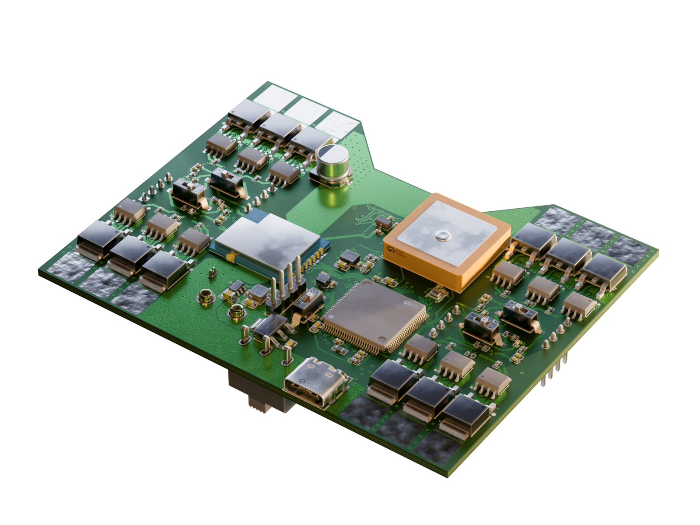
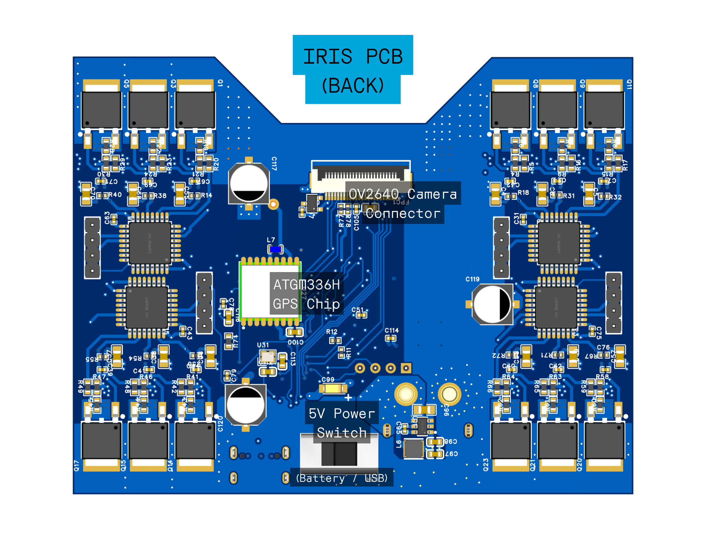

# IRIS

> A low-cost quadcopter platform designed for autonomous swarm operations.

## Overview
IRIS is centered around a mass-manufacturable low-cost PCB, containing a flight controller and 4 ESCs. Designed with the idea of delivering Skittles autonomously, IRIS is built from the ground-up for autonomous operation in swarms. With a rich sensor set and high degree of customizability, IRIS represents an accessible, low-cost entry into the world of autonomous and swarm drone design.

## Features
 - STM32H743 MCU
 - IMU, Barometer, Magnetometer, GPS
 - Integrated 4-in-1 ESC with sensorless drive
 - OV2640 camera for computer vision
 - 2.4GHz Radio Transciever + nanoELRS header
 - 2S LiPo input, XT60 connector
 - 3D-printed frame

## Table of Contents
- [Design Features](#design-features)
  - [Flight Controller Design](#flight-controller-design)
  - [ESC Design](#esc-design)
  - [Frame Design](#frame-design)
- [Getting Started](#getting-started)
- [PCB Assembly](#pcb-assembly)
- [Drone Assembly](#drone-assembly)
- [Firmware](#firmware)
- [Roadmap](#roadmap)

## Design Features

### Flight Controller Design

  
&nbsp; &nbsp; &nbsp; &nbsp;
  

[Schematic](./pcb/schematics/Flight_Controller_Schematic.svg)

The PCB design features a 4-layer PCB stackup for lowered manufacturing costs, with a (nearly) continuous ground plane for reduced RF interference. The area under the MCU and core sensors also feature a continuous 3.3V power plane. The high voltage and current for the ESCs are routed on large copper pours on the bottom layer, with cross-layer connections connected by suture vias.

The total board dimensions are 3.650" by 2.856", a little larger than a credit card.

The main flight controller MCU is programmable over USB. The 4 ESC MCUs require a serial programmer, with ground, rx and tx exposed on header pins. All MCUs have a dedicated switch for a physical boot selector.

### ESC Design

[Schematic](./pcb/schematics/ESC_Schematics/Motor1_ESC_Schematic.svg)

The ESC design features an AT32F421 microcontroller, a very powerful MCU that enables accurate back-emf drive even for high kV motors. The AT32F421 MCU is fully supported by the open-source [AM32](https://github.com/am32-firmware/AM32) ESC firmware and can be controlled using DShot or PWM.

### Frame Design
The frame design merges swooping curves and sharp geometric angles in a retrofuturistic visual style. Inspired by the Theme Building at LAX, the frame arms are each constructed with 3 catenary curves, with the bottom arches merging together to form the cradle for the battery.

The drone frame is constructed in two pieces and held together by 8 M2 screws. The bottom half contains a battery mount and 4 9x9mm motor mounts, while the top half clamps the PCB down. The top cover shields the bulk of the PCB while leaving the high-current ESC MOSFET sections exposed for cooling, and is bolted down using 8 10mm long M2 screws and heat set inserts on the bottom half.

## Getting Started

### Prerequisites

- EasyEDA Pro (recommended)
- KiCAD 10.0 (broken DRC rules)
- Fusion 360
- Blender 5.0+

### For KiCAD Users:
This project was made in the free software EasyEDA Pro, and the design is native to that software. The PCB design has been converted to a KiCAD project for easier access to the design.
> NOTE: The KiCAD imported project relies on 3D models and footprints from LCSC, which should be imported using [easyeda2kicad.py](https://github.com/uPesy/easyeda2kicad.py) as follows:
> `easyeda2kicad --full --lcsc_id C19702 C29266 C53084459 C602037 C23630 C100042 C19666 C95841 C86295 C7171 C1644 C106245 C47023104 C98732 C2856805 C52016392 C76891 C7427089 C6807998 C784395 C19268133 C98220 C2907028 C2906920 C163475 C60491 C106235 C105871 C2907044 C628050 C1850418 C83291 C478483 C7421519 C3029575 C2071056 C481371 C90770 C49446790 C2892669 C1985532 C2965508 C114409 C7431054 C709357 --output `**`<full path to pcb/kicad folder>`**`\libs\lcsc_import_lib --project-relative --overwrite `

### Repository Structure
All of the files for the flight controller + ESC board are contained in `pcb/`, with fabrication files in `pcb/fabrication/`. All fabrication files are to [JLCPCB](https://jlcpcb.com/) specifications. All part numbers are from LCSC.

The frame CAD files can be found in the `frame/` directory, with (metric) STL and 3MF exports ready for 3D printing.

All of the renders on the documentation were created using Blender 5.1, and render files can be found in `docs/render/`.

## PCB Assembly

### Bill of Materials
[Full BOM](./pcb/fabrication/BOM.md)

Total cost from LCSC: **$79.91**
[LCSC BOM](./pcb/fabrication/BOM_Board1_PCB1_2026-05-03.xlsx)

### Assembly

The [PCB gerbers](./pcb/fabrication/gerbers.zip) can be manufactured by JLCPCB with the simple 4-layer PCBA economical service. Two-sided automated assembly is quite expensive however, so first prototypes will be assembled manually using solder stencils. PCB components can be ordered from LCSC using the [LCSC BOM](./pcb/fabrication/BOM_Board1_PCB1_2026-05-03.xlsx).
> NOTE: The large copper pours are connected directly to a lot of the pads, manual soldering will require the use of a hot air rework station and powerful soldering iron

## Drone Assembly

### Components

| Part | Description | Manufacturer | Price |
| --- | ----------- | ------------ | ----- |
| FC+ESC | IRIS PCB |  | ~150.00 |
| Frame | IRIS Frame |  | ~2.00 |
| Battery | 1000 mAh 2S LiPo | Admiral | 9.99 |
| Motors | 4x 8000 kV 1103 Brushless DC | HappyModel | 23.99 |
| Propellers | 2.5" |
| Camera | OV2640 with SCCB cable | Arducam | 6.99 |
| Heat-set inserts | M2x2.5mm, 3.5mm OD Knurled Brass Threaded Heat Set Inserts | Rusty Bolt Shop | $1.70 |
| M2x10mm screws | | The Rusty Bolt Shop |
| M2x8mm screws | | The Rusty Bolt Shop |
| Vibration dampening foam | 3M Double Coated Urethane Foam Tape 4056 | 

### Assembly
1. Print the frame in two sections
2. Attach heat-set inserts with a soldering iron on the base frame
3. Cut 4056 foam to shape and attach to the PCB contact areas on both sides of the frame 
4. Insert the assembled PCB and bolt down all 8 M2x10mm screws
5. Fasten top and bottom of the frame to secure the PCB
6. Insert the battery into the cradle underneath the PCB, fasten with velcro strips across horizontal beams
7. Attach brushless motors with M2x8mm screws
8. Attach propellers to brushless motors
9. Fly!

## Firmware
This flight controller is Betaflight-compatible, although I still need to write the configuration files for the firmware. The firmware will need to be written and tested once the PCB is assembled.

## Roadmap

- [X] PCB designed
- [ ] Case designed
- [ ] PCB assembled
- [ ] Prototype assembled
- [ ] Prototype tested
- [ ] Firmware finalized
- [ ] PCB mass-produced

## License

Everything is [GNU GPL-3.0](LICENSE)

rostock_laage_airport_4k.exr is CC0 from PolyHaven, credit to Greg Zaal