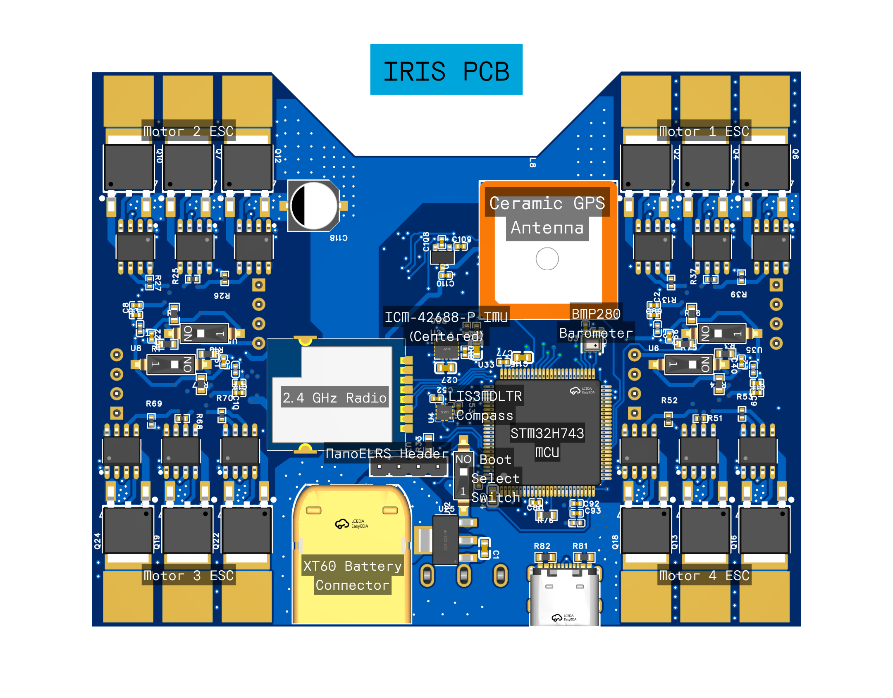

# IRIS

> A low-cost quadcopter platform designed for autonomous swarm operations.

## Overview
IRIS is centered around a mass-manufacturable low-cost PCB, containing a flight controller and 4 ESCs. Designed with the idea of delivering Skittles autonomously, IRIS is built from the ground-up for autonomous operation in swarms. With a rich sensor set and high degree of customizability, IRIS represents an accessible, low-cost entry into the world of autonomous and swarm drone design.

## Features
 - STM32H743 MCU
 - IMU, Barometer, Magnetometer, GPS
 - Integrated 4-in-1 ESC with sensorless drive
 - OV2640 camera for computer vision
 - 2.4GHz Radio Transciever + nanoELRS header
 - 2S LiPo input, XT60 connector
 - 3D-printed frame

## Table of Contents

## Design Features

### PCB Design

The PCB design features a 4-layer PCB stackup for lowered manufacturing costs, with a (nearly) continuous ground plane for reduced RF interference. The area under the MCU and core sensors also feature a continuous 3.3V power plane. The high voltage and current for the ESCs are routed on large copper pours on the bottom layer, with cross-layer connections connected by suture vias.

The total board dimensions are 3.650" by 2.856", a little larger than a credit card.

The main flight controller MCU is programmable over USB. The 4 ESC MCUs require a serial programmer, with ground, rx and tx exposed on header pins. All MCUs have a dedicated switch for a physical boot selector.

### ESC Design

### 3D Printed Frame
The IRIS board is highly versatile, compatible with many motor and propeller types, and users are encouraged to design custom housings and experiment with varying batteries and motors. For new drone enthusiasts, IRIS recommends a 2S setup with 1103 motors.
This beginner setup pairs nicely with the minimalist frame to provide a simple low-cost entry into autonomous drones.

## PCB Assembly Instructions

### Bill of Materials
[Full BOM](./pcb/BOM.md)

Total cost from LCSC: **$79.91**
[LCSC BOM](./pcb/BOM_Board1_PCB1_2026-05-03.xlsx)

### Assembly

The [PCB gerbers](./pcb/Gerber_V2.zip) can be manufactured by JLCPCB with the simple 4-layer PCBA economical service. Two-sided automated assembly is quite expensive however, so first prototypes will be assembled manually using solder stencils. PCB components can be ordered from LCSC using the [LCSC BOM](./pcb/BOM_Board1_PCB1_2026-05-03.xlsx).

## Drone Assembly

### Components

| Part | Description | Manufacturer | Price |
| --- | ----------- | ------------ | ----- |
| FC+ESC | IRIS PCB |  | ~150.00 |
| Frame | IRIS Frame |  | ~2.00 |
| Battery | 1000 mAh 2S LiPo | Admiral | 9.99 |
| Motors | 4x 8000 kV 1103 Brushless DC | HappyModel | 23.99 |
| Propellers | 2.5" |
| Camera | OV2640 with SCCB cable | Arducam | 6.99 |

### Assembly
1. Print the frame
2. Insert assembled PCB and attach using foam pads
3. Fasten top and bottom of the frame to secure the PCB
4. Insert the battery into the cradle underneath the PCB, fasten with velcro strips across horizontal beams
5. Attach brushless motors with M2 screws
6. Attach propellers to brushless motors
7. Fly!

## Firmware
This flight controller is Betaflight-compatible, although I still need to write the configuration files for the firmware. The firmware will need to be written and tested once the PCB is assembled.

## Roadmap

- [X] PCB designed
- [ ] Case designed
- [ ] PCB assembled
- [ ] Prototype assembled
- [ ] Prototype tested
- [ ] Firmware finalized
- [ ] PCB mass-produced

## License

Everything is [GNU GPL-3.0](LICENSE)